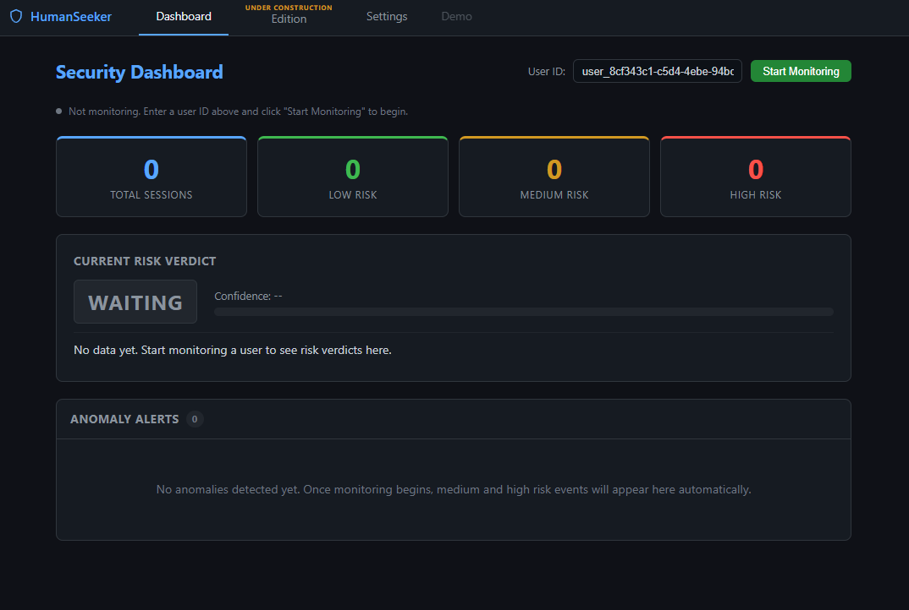
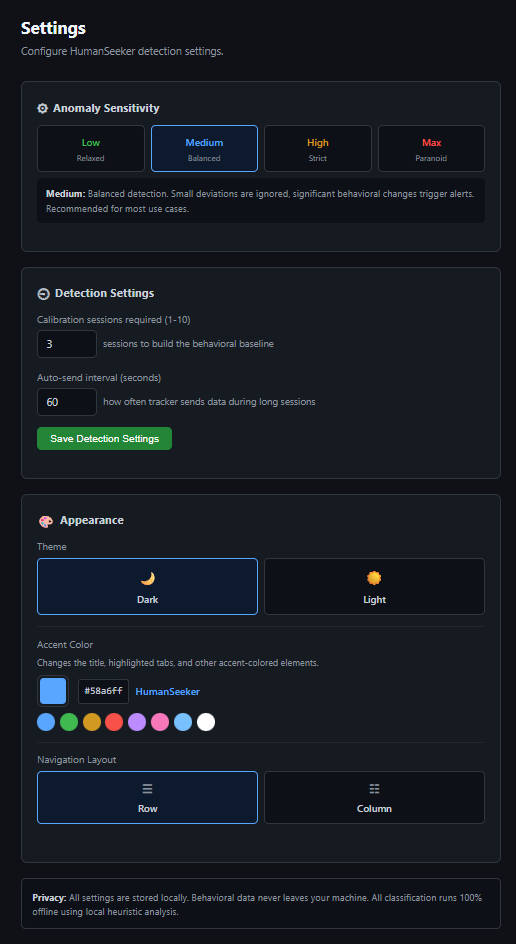
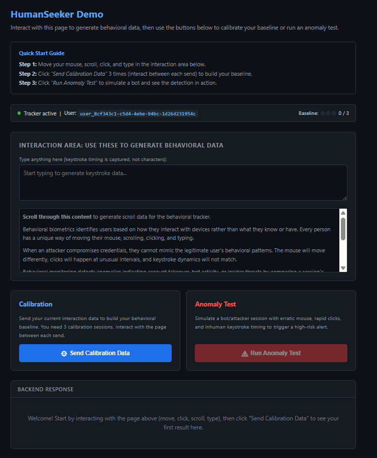

# HumanSeeker: Behavioral Security Monitor

A desktop application that detects unauthorized access by analyzing real-time behavioral biometrics: mouse movement patterns, keystroke timing, click frequency, and scroll pacing.

## Screenshots

### Dashboard


### Settings


### Demo


## How It Works

1. **Browser Capture:** A lightweight JavaScript tracker records mouse velocity, keystroke hold/interval times, click patterns, and scroll behavior (no keystrokes or personal data are captured).
2. **Baseline Learning:** The first 3 sessions build a per-user behavioral profile using rolling averages.
3. **Deviation Scoring:** Each new session is compared against the baseline using z-score normalization across 8 behavioral features.
4. **Classification:** A weighted multi-signal heuristic engine classifies sessions as Low / Medium / High risk. Runs 100% offline.

## Features

- **Fully offline:** No API keys, no external services. Everything runs locally.
- **Configurable sensitivity:** Low, Medium, High, and Max sensitivity presets.
- **Live dashboard:** Real-time session counters, current verdict display, and anomaly alert history.
- **Interactive demo:** Built-in guided calibration and anomaly testing with step-by-step onboarding.
- **Desktop app:** Native window via pywebview (no browser needed).
- **Accessible:** Keyboard navigable, screen reader friendly, high contrast UI.

## Project Structure

```
behavioral-monitor/
  main.py                  # Entry point: Flask thread + pywebview window
  config.py                # Path resolution (dev vs frozen .exe)
  requirements.txt         # Python dependencies

  backend/
    app.py                 # Flask app factory, API routes, frontend serving
    classifier.py          # Weighted multi-signal heuristic classifier
    feature_extractor.py   # Extracts 8 behavioral features from raw session data
    baseline_manager.py    # Per-user JSON baseline storage with exponential moving average
    deviation_scorer.py    # Z-score normalization with sensitivity-aware capping

  frontend/
    index.html             # Navigation shell (Dashboard | Demo | Edition | Settings)
    dashboard.html         # Live counters, verdict display, anomaly alert log
    demo.html              # Calibration + anomaly testing interface
    edition.html           # Plan/tier selection
    settings.html          # Sensitivity and detection settings
    tracker.js             # Browser behavioral data capture

  tests/
    test_pipeline.py       # Integration tests
```

## Running from Source

```bash
pip install -r requirements.txt
python main.py
```

## Building the .exe

```bash
pip install pyinstaller
pyinstaller HumanSeeker.spec
```

